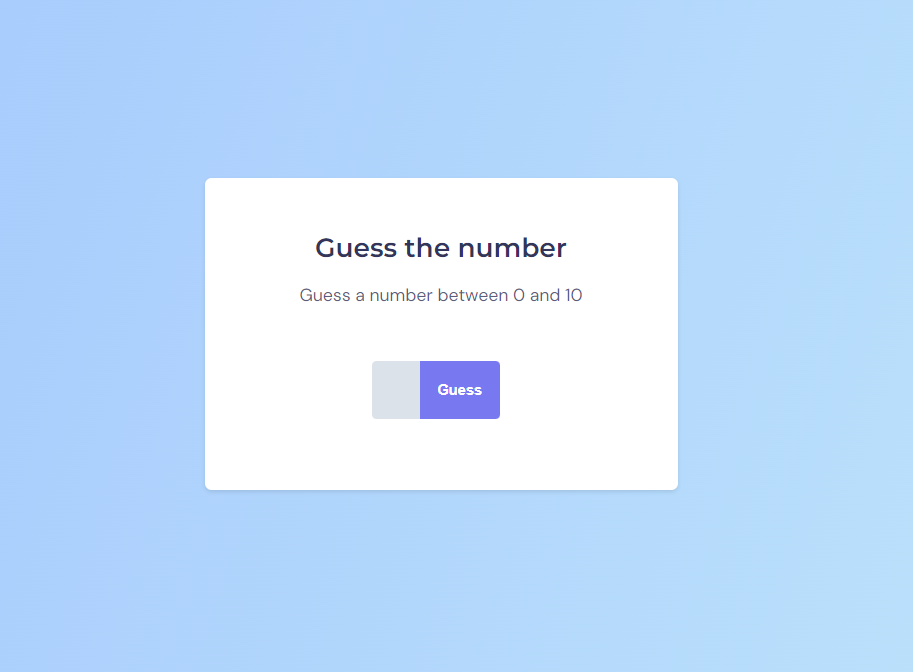
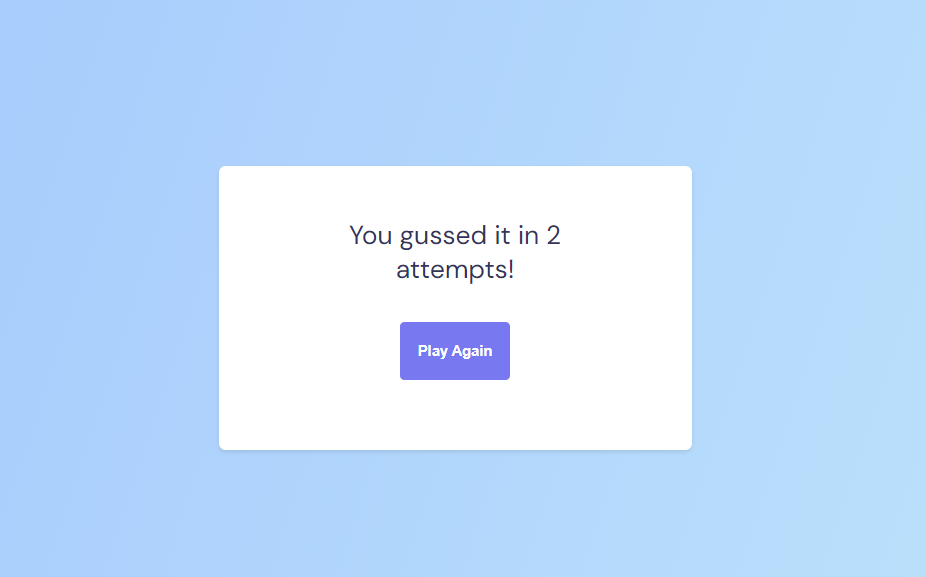

# Guess the Number

This is a game where the player has to guess a number between 0 and 10. The number is randomly selected using JavaScript and the number of attemps is displayed after the correct guess.
> 

## 👩🏾‍💻 Technologies

- HTML5
- CCS3
- JavaScript
- Git and Github

> 

## ✉ Contact

contatolucioaraujo@gmail.com

[Linkedin](https://www.linkedin.com/in/lucioaraujo30/)